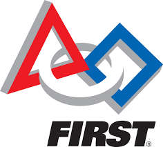
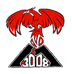

  
  

FIRST Robotics Compeition is an international program where teams of highschoolers design and create a robots to complete certain challenges in competition. The program was created to promote STEM education to students in a hands on and creative way. FIRST stand for For Inspiration and Recognition of Science and Technology. The program promotes other qualities such as community building, entrepreneurship, and sustainability.

You can learn more about FIRST at the [FIRST website] (http://www.firstinspires.org).

There are many awards given out during the FIRST season. The most prestigious among them is the Chairmen's Award. This is given to team that best represents all the goals of FIRST. I was involved in preparing Kalani students for the presentation that they needed to give to be eligible for the Chairmen's Award.

