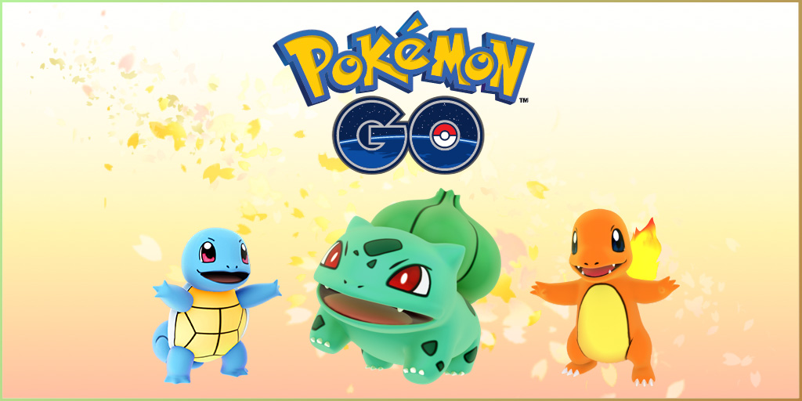

  
  

  For my ICS 211 project we tried to recreate a smaller version of the pokemon Go app in Java. The end result was a game that was more like a simple version of the original pokemon games. 

  The goal of the project was to learn about object-oriented programming. The framework for the project was provided to us by our professor, Lisa Miller. We learned about subclasses, inheritance, and abstract classes. We also learned a lot about the uses of github, a skill that's very important now and in the future. 

Link to the game: <a href="https://github.com/kenkawano/assignment-5-pokegui-kenkawano">game</a>

